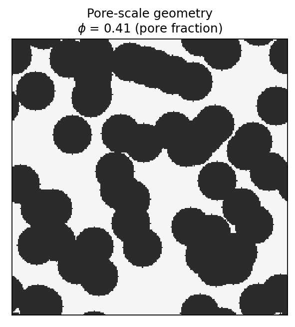
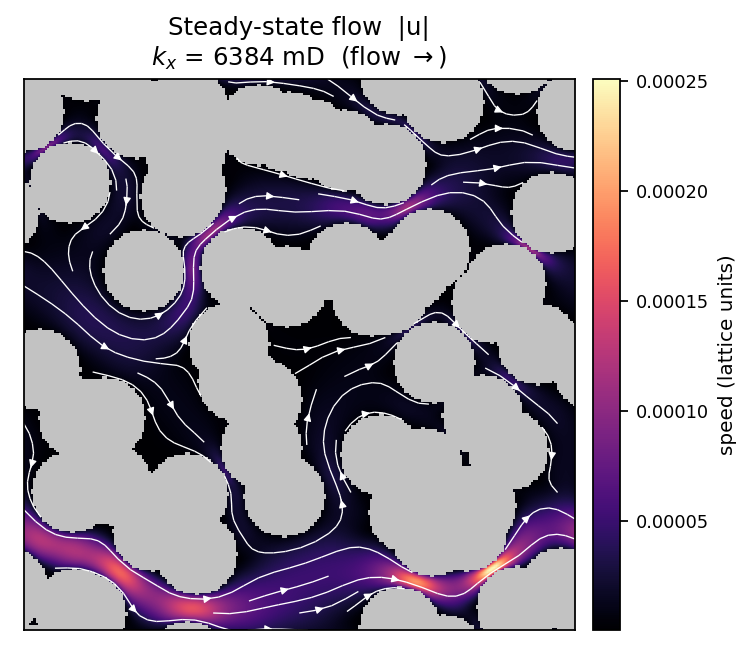
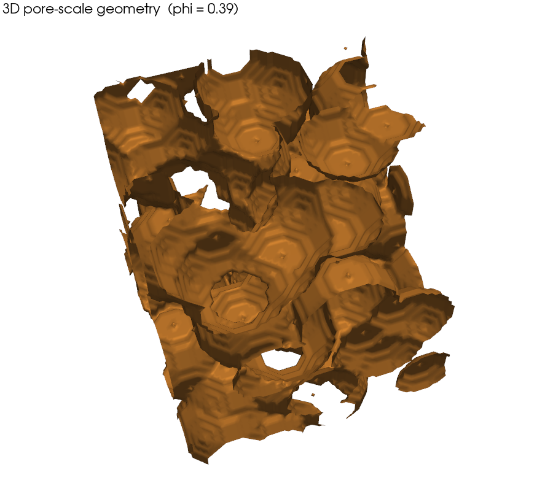
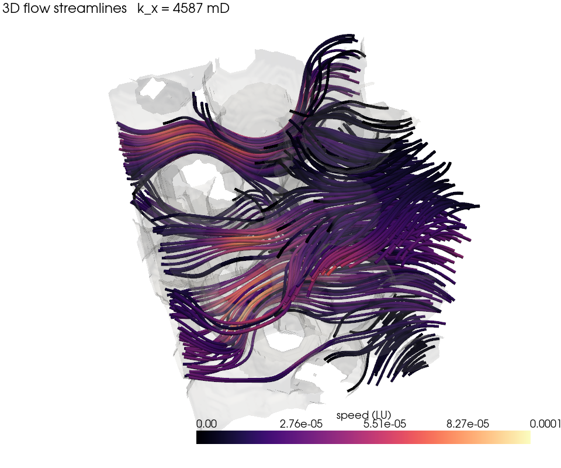

# LBM Permeability Solver

A compact, GPU-accelerated **lattice-Boltzmann (LBM)** solver that computes the
**absolute (Darcy) permeability** of a pore-scale binary image — the kind of
calculation at the heart of digital-rock physics and porous-media flow.

Feed it a segmented image (rock grains vs. pore space, from micro-CT or a
pore-scale simulation) and it returns the permeability in physical units
(m², milliDarcy) by directly simulating creeping flow through the pore network.

```
binary image  ──►  LBM Stokes flow  ──►  steady-state velocity field  ──►  k  [mD]
(True = solid)      (D2Q9 / D3Q19)        (Darcy's law)
```

<p align="center">
  
  &nbsp;&nbsp;
  
</p>

<p align="center">
  <em>Left: a 2D pore-scale geometry (grains vs. pore space). Right: the
  steady-state speed field and flow streamlines computed by the solver — most
  of the flux is carried by a few dominant throats. Reproduce with
  <code>python examples/visualize.py</code>.</em>
</p>

The same solver runs in 3D (D3Q19). Below: a 64³ grain pack and the flow
streamlines threading through its pore space, colored by speed.

<p align="center">
  
  &nbsp;&nbsp;
  
</p>

<p align="center">
  <em>3D pore-scale geometry and computed flow field. Reproduce with
  <code>python examples/visualize_3d.py</code> (needs PyVista).</em>
</p>

| | |
|---|---|
| **Method** | Single-phase Stokes flow, D2Q9 (2D) and D3Q19 (3D), BGK collision, Guo body force |
| **Backend** | CuPy on GPU, automatic NumPy/CPU fallback — same code path |
| **Validation** | Plane-Poiseuille flow, 2.4 % error at 40-cell aperture, 2nd-order convergence |
| **Dependencies** | NumPy (required); CuPy (optional, for GPU) |

This solver was developed for and used in a research study of how CO₂-hydrate
formation alters the permeability of porous media; it produced the permeability
results behind that work across 2D (750×750) and 3D (200³) pore-scale domains.

---

## The physics

Darcy's law relates the superficial flow rate `q` to a driving force through the
permeability `k`:

```
q = (k / μ) · ∇P
```

Instead of imposing a pressure gradient, the solver applies a uniform **body
force** `F` to the fluid. At steady state `ρ·F` balances `∇P`, so with the LBM
convention `ρ = 1`, `μ = ν`:

```
k_LU [cells²] = ⟨u⟩_total · ν / F
```

where `⟨u⟩_total` is the **superficial velocity** — the velocity averaged over
the *whole* domain, with solid cells counted as `u = 0`. The result is converted
to physical units with the cell size `dx`:

```
k [m²] = k_LU · dx²        1 mD = 9.869233e-16 m²
```

**Numerical recipe**

- **D2Q9 / D3Q19** velocity sets with single-relaxation-time (BGK) collision.
- **Guo forcing** for the body force, with the half-force correction applied
  consistently to both the equilibrium velocity and the macroscopic moments.
- **Half-way bounce-back** at solid cells → no-slip walls at the pore boundary.
- **Fully periodic** domain boundaries.
- Steady state declared when the relative change in mean speed `⟨|u|⟩` over a
  window of steps falls below a tolerance.

---

## Install

```bash
git clone https://github.com/SalehMohammadrezaei/LBM-Permeability.git
cd LBM-Permeability
pip install -e .            # NumPy only

# For GPU (pick the wheel matching your CUDA toolkit):
pip install cupy-cuda12x
```

No install is strictly required — the example scripts add the repo root to the
path themselves, so `python examples/run_2d.py --demo` works from a fresh clone.

## Quick start

```bash
# Synthetic random-disk geometry — runs out of the box, no data needed
python examples/run_2d.py --demo

# Your own segmented image (.npy bool array, True = solid)
python examples/run_2d.py mask.npy --direction x --dx 2e-6

# 3D volume
python examples/run_3d.py --demo
```

As a library:

```python
import numpy as np
from lbm_permeability import lbm_stokes, k_from_run, k_lu_to_m2, k_m2_to_millidarcy

blocked = np.load("mask.npy").astype(bool)      # True = solid

res  = lbm_stokes(blocked, F_x=1e-6, tau=1.0)   # drive flow in +x
k_lu = k_from_run(res, "x")                     # cells²
k_m2 = k_lu_to_m2(k_lu, dx_phys=2e-6)           # m²
print(k_m2_to_millidarcy(k_m2), "mD")
```

## Validation

The solver is checked against two analytical references with known
closed-form permeability.

**1. Plane-Poiseuille flow** (flat walls, exact). Flow between parallel plates
has superficial permeability `k = (a²/12)·(gap/Ny)` with effective aperture
`a = gap + 1` for half-way bounce-back. The discrete result converges to the
analytical value at second order as the channel is refined:

| Aperture (cells) | Relative error |
|---|---|
| 10 | 9.1 % |
| 20 | 4.8 % |
| 40 | 2.4 % |

```bash
python tests/test_poiseuille.py     # runs with or without pytest
```

**2. Square array of cylinders** (a model porous medium with curved
boundaries). Transverse Stokes flow through a periodic array of cylinders at
solid fraction `c` has the Sangani & Acrivos (1982) permeability
`k/a² = (1/8c)[−ln c − 1.476 + 2c − 1.774c² + 4.076c³]`. Run to true steady
state (GPU), the solver matches it to ~3 % in the regime where that asymptotic
series is valid:

| Solid fraction c | k/a² (LBM) | k/a² (Sangani–Acrivos) | error |
|---|---|---|---|
| 0.10 | 1.293 | 1.257 | 2.9 % |
| 0.15 | 0.589 | 0.573 | 2.8 % |
| 0.20 | 0.320 | 0.312 | 2.5 % |
| 0.30 | 0.106 | 0.116 | 8.2 % |

The c = 0.30 point widens because the reference series is a *dilute* expansion
that loses accuracy at high solid fraction — not a solver error.

```bash
python validation/cylinder_array.py    # GPU recommended
```

## Repository layout

```
lbm_permeability/
  d2q9.py        2D D2Q9 Stokes solver
  d3q19.py       3D D3Q19 Stokes solver (heartbeat, memory-pool mgmt, timeout)
  units.py       lattice-unit ↔ m² ↔ milliDarcy conversions + Darcy's law
  geometry.py    synthetic test geometries (channel, disk/sphere packs)
examples/
  run_2d.py      CLI: permeability of a 2D image (or synthetic demo)
  run_3d.py      CLI: permeability of a 3D volume (or synthetic demo)
  visualize.py     render the 2D geometry + velocity-field figures (docs/)
  visualize_3d.py  render the 3D grain pack + flow streamlines (docs/, PyVista)
tests/
  test_poiseuille.py   analytical validation (flat-wall, exact)
validation/
  cylinder_array.py    benchmark vs. Sangani-Acrivos cylinder-array theory
```

## Notes & scope

- The solver computes **single-phase absolute permeability**. Multiphase /
  relative permeability is a separate problem.
- 3D runs are heavy: a 200³ volume is minutes-per-1000-steps on a GPU and
  impractical on CPU. The 3D solver includes a heartbeat, periodic GPU
  memory-pool flushing, and a wall-clock safety timeout for long jobs.
- Body force, relaxation time `tau`, and tolerance are kept low enough to stay
  in the Stokes (creeping-flow) regime where Darcy's law applies.

## License

MIT — see [LICENSE](LICENSE).
