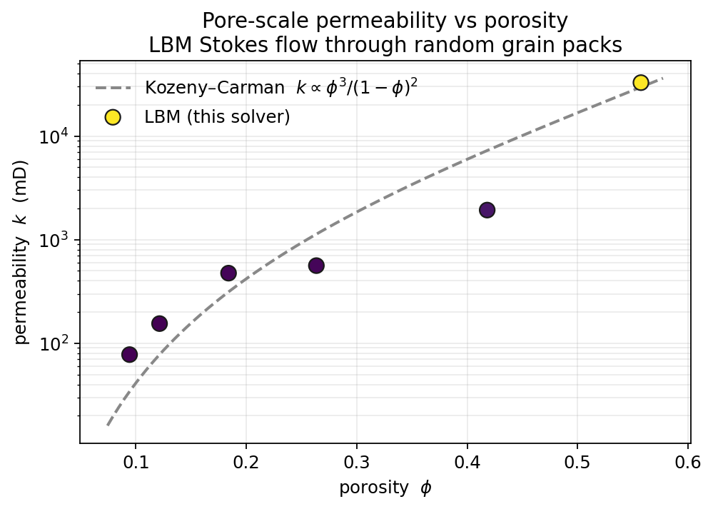

<h1 align="center">LBM Permeability Solver</h1>

<p align="center">
  <b>GPU-accelerated lattice-Boltzmann flow solver that computes the absolute (Darcy) permeability of a pore-scale image — the core calculation of digital-rock physics.</b>
</p>

<p align="center">
  
  
  
  
</p>

Feed it a segmented image — rock grains vs. pore space, from micro-CT or a
pore-scale simulation — and it returns the permeability in physical units (m²,
milliDarcy) by directly simulating creeping flow through the pore network.

```
  binary image  ──►  LBM Stokes flow  ──►  steady velocity field  ──►   k  [mD]
  (True = solid)     (D2Q9 / D3Q19)         (Darcy's law)
```

<p align="center">
  
  &nbsp;&nbsp;
  
</p>

<p align="center">
  <em>Left: a 2D pore-scale geometry (grains vs. pore space). Right: the
  steady-state speed field and flow streamlines — most of the flux is carried by
  a few dominant throats. Reproduce with <code>python examples/visualize.py</code>.</em>
</p>

---

## Results

Run across random grain packs of increasing solid fraction, the measured
permeability follows the classic **Kozeny–Carman** trend `k ∝ φ³/(1−φ)²` —
permeability falls by orders of magnitude as the pores close up. The scatter
about the curve is real: each point is a different random packing, not an
idealized medium.

<p align="center">
  
</p>

The same solver runs in 3D (D3Q19). Below: a 64³ grain pack and the flow
streamlines threading through its pore space, colored by speed.

<p align="center">
  
  &nbsp;&nbsp;
  
</p>

<p align="center">
  <em>3D pore-scale geometry and computed flow field. Reproduce with
  <code>python examples/visualize_3d.py</code> (needs PyVista).</em>
</p>

| | |
|---|---|
| **Method** | Single-phase Stokes flow · D2Q9 (2D) / D3Q19 (3D) · BGK collision · Guo body force |
| **Backend** | CuPy on GPU, automatic NumPy/CPU fallback — *same code path* |
| **Validation** | Plane-Poiseuille (2.4 % at a 40-cell aperture, error halving with resolution) · Sangani–Acrivos cylinder array (~3 %) |
| **Dependencies** | NumPy (required) · CuPy (optional, GPU) · Matplotlib/PyVista (figures only) |

### One code path, CPU or GPU

The solver runs identically on NumPy (CPU) or CuPy (GPU) — the backend is chosen
automatically. Small grids tie (GPU kernel-launch overhead cancels the gain), but
at the resolutions that matter the GPU dominates — and its time barely grows with
the grid:

| Grid (1500 steps) | CPU (NumPy) | GPU (RTX 6000 Ada) | speedup |
|---|---|---|---|
| 256² | 7 s | 9 s | ~1× |
| 768² | 171 s | 8 s | **≈21×** |

That is what makes the research-scale 750×750 (2D) and 200³ (3D) runs tractable.

> Developed for a research study of how **CO₂-hydrate formation alters the
> permeability of porous media**, producing the permeability results behind that
> work across 2D (750×750) and 3D (200³) pore-scale domains.

### Fused CUDA kernel for 3D

3D volumes run through a **fused collide/stream CUDA kernel** (`d3q19_fast`) rather
than array operations. It does the whole step in two custom kernels — one read +
one write of the distribution array each — instead of ~40 separate elementwise
ops, so it actually uses the GPU's memory bandwidth. Same numerics (it matches the
readable array solver to machine precision), **~10× faster**, with a `float32`
option that halves the memory:

| 400³ · D3Q19 · RTX 6000 Ada | per step | peak memory |
|---|---|---|
| array reference | ~975 ms | ~19 GB |
| fused kernel · float64 | ~96 ms | ~25 GB |
| fused kernel · float32 | ~83 ms | ~13 GB |

A converged 400³ permeability run therefore drops from hours to roughly **10–20
minutes** (often less for open, high-porosity samples). The kernel is on by
default on GPU (`use_kernel=True`); pass
`precision="float32"` for the lowest memory, or `use_kernel=False` for the
readable pure-array path.

---

## The physics

Darcy's law relates the superficial flow rate `q` to a driving force through the
permeability `k`:

```
q = (k / μ) · ∇P
```

Instead of imposing a pressure gradient, the solver applies a uniform **body
force** `F` to the fluid. At steady state `ρ·F` balances `∇P`, so with the LBM
convention `ρ = 1`, `μ = ν`:

```
k_LU [cells²] = ⟨u⟩_total · ν / F
```

where `⟨u⟩_total` is the **superficial velocity** — averaged over the *whole*
domain, with solid cells counted as `u = 0`. It is converted to physical units
with the cell size `dx`:

```
k [m²] = k_LU · dx²        1 mD = 9.869233e-16 m²
```

**Numerical recipe**

- **D2Q9 / D3Q19** velocity sets with single-relaxation-time (BGK) collision.
- **Guo forcing** for the body force, with the half-force correction applied
  consistently to the equilibrium velocity and the macroscopic moments.
- **Half-way bounce-back** at solid cells → no-slip walls at the pore boundary.
- **Fully periodic** domain boundaries.
- Steady state declared when the relative change in mean speed `⟨|u|⟩` over a
  window of steps falls below a tolerance.

---

## Install

```bash
git clone https://github.com/SalehMohammadrezaei/LBM-Permeability.git
cd LBM-Permeability
pip install -e .                 # NumPy only

pip install cupy-cuda12x         # optional GPU (match your CUDA toolkit)
```

No install is strictly required — the example scripts add the repo root to the
path, so `python examples/run_2d.py --demo` works from a fresh clone.

## Quick start

```bash
# Synthetic random-disk geometry — runs out of the box, no data needed
python examples/run_2d.py --demo

# Your own segmented image (.npy bool array, True = solid)
python examples/run_2d.py mask.npy --direction x --dx 2e-6

# 3D volume
python examples/run_3d.py --demo
```

As a library:

```python
import numpy as np
from lbm_permeability import lbm_stokes, k_from_run, k_lu_to_m2, k_m2_to_millidarcy

blocked = np.load("mask.npy").astype(bool)      # True = solid

res  = lbm_stokes(blocked, F_x=1e-6, tau=1.0)   # drive flow in +x
k_lu = k_from_run(res, "x")                     # cells²
k_m2 = k_lu_to_m2(k_lu, dx_phys=2e-6)           # m²
print(k_m2_to_millidarcy(k_m2), "mD")
```

## Validation

Checked against two analytical references with closed-form permeability.

**1. Plane-Poiseuille flow** (flat walls, exact). Flow between parallel plates
has superficial permeability `k = (a²/12)·(gap/Ny)` with effective aperture
`a = gap + 1` for half-way bounce-back. The discrete result approaches the
analytical value as the channel is refined — the error roughly **halves with
each doubling** of the aperture:

| Aperture (cells) | 10 | 20 | 40 |
|---|---|---|---|
| **Relative error** | 9.1 % | 4.8 % | 2.4 % |

```bash
python tests/test_poiseuille.py     # runs with or without pytest
```

**2. Square array of cylinders** (curved boundaries). Transverse Stokes flow
through a periodic cylinder array at solid fraction `c` has the Sangani &
Acrivos (1982) permeability `k/a² = (1/8c)[−ln c − 1.476 + 2c − 1.774c² +
4.076c³]`. Run to true steady state, the solver matches it to **~3 %** where
that asymptotic series is valid:

| Solid fraction c | 0.10 | 0.15 | 0.20 | 0.30 |
|---|---|---|---|---|
| **k/a² (LBM)** | 1.293 | 0.589 | 0.320 | 0.106 |
| **k/a² (Sangani–Acrivos)** | 1.257 | 0.573 | 0.312 | 0.116 |
| **error** | 2.9 % | 2.8 % | 2.5 % | 8.2 % |

The `c = 0.30` point widens because the reference is a *dilute* expansion that
loses accuracy at high solid fraction — not a solver error.

```bash
python validation/cylinder_array.py    # GPU recommended
```

## Repository layout

```
lbm_permeability/
  d2q9.py        2D D2Q9 Stokes solver
  d3q19.py       3D D3Q19 Stokes solver (heartbeat, memory-pool mgmt, timeout)
  units.py       lattice-unit ↔ m² ↔ milliDarcy conversions + Darcy's law
  geometry.py    synthetic test geometries (channel, disk/sphere packs)
examples/
  run_2d.py              CLI: permeability of a 2D image (or synthetic demo)
  run_3d.py              CLI: permeability of a 3D volume (or synthetic demo)
  visualize.py           render the 2D geometry + velocity-field figures
  visualize_3d.py        render the 3D grain pack + flow streamlines (PyVista)
  permeability_curve.py  sweep porosity → the permeability-vs-porosity figure
tests/
  test_poiseuille.py     analytical validation (flat-wall, exact)
validation/
  cylinder_array.py      benchmark vs. Sangani–Acrivos cylinder-array theory
```

## Notes & scope

- Computes **single-phase absolute permeability**. Multiphase / relative
  permeability is a separate problem.
- 3D is GPU territory: the fused kernel does a 400³ step in ~0.08–0.1 s, so a
  converged run is ~10–20 min (use `precision="float32"` to halve the memory). The pure-array
  path (`use_kernel=False`) and CPU fallback also exist for portability/clarity, and
  the solver keeps a heartbeat, periodic memory-pool flushing, and a wall-clock
  safety timeout for long jobs.
- Body force, relaxation time `tau`, and tolerance are kept low enough to stay
  in the Stokes (creeping-flow) regime where Darcy's law applies.

## License

MIT — see [LICENSE](LICENSE).  ·  Built by **Saleh Mohammadrezaei** · salehmrezaee@gmail.com
