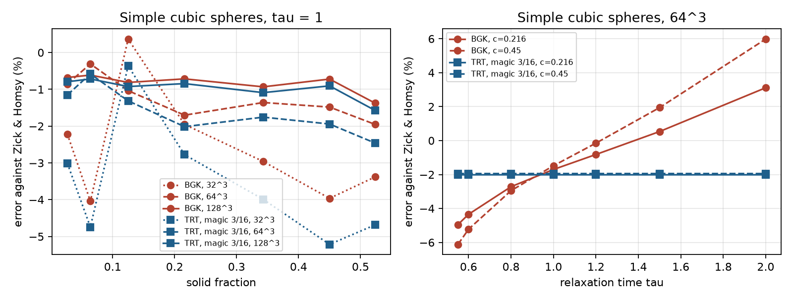

# PoreWise

**Absolute permeability tensors of 3D pore images, on one GPU or on CPU cores.**
A lattice-Boltzmann Stokes solver that stores only the pore voxels, uses a
two-relaxation-time collision so the answer does not depend on the relaxation time,
and checks every run before it reports a number.


*Bentheimer sandstone (Digital Rocks Portal DRP-29, 256-cube piece, 5 um voxels): grains
in the back half, streamlines of the computed flow in the front half, coloured by speed.*

## Why another permeability code

| | |
|---|---|
| **Viscosity-independent results** | With BGK and bounce-back the wall position moves with the relaxation time. On Bentheimer sandstone BGK gives 3.27 to 5.11 darcy for tau from 0.6 to 1.5. The TRT collision (magic parameter 3/16) gives 4.1024 darcy at every tau. |
| **Pore-only storage** | Solid voxels cost no memory and no work. A 1024-cube Fontainebleau image needs 18.5 GB instead of 326 GB and runs on one workstation GPU. |
| **GPU and CPU, one algorithm** | `cuda-sparse` and `numba-sparse` share the scheme. On a 1024-cube Berea image they stop at the same step and agree in k to 9e-8. |
| **Full tensor** | Three independent loads give the 3x3 tensor, its symmetric part, principal values and directions, and a reciprocity check. |
| **Guarded output** | A run is accepted only if it converged and passed mass, density and Mach checks. Rejected runs return no permeability. |

## Verification

All numbers are reproduced by `benchmarks/verification.py` and written up in
[docs/trt_sparse_status.md](docs/trt_sparse_status.md).

| Case | Reference | Result |
|---|---|---|
| Plane channel, tau 0.55 to 2.0 | analytical | TRT exact at every node for every tau; BGK error -2.3 % to +25.6 % at 8 nodes across |
| Simple cubic sphere arrays, 7 solid fractions | Zick and Homsy (1982) | 0.7 to 1.6 % at 128-cube; spread over tau: TRT 0.00 %, BGK 8 to 12 % |
| Inclined slit, 0 to 63.4 degrees | geometry | principal direction recovered to 1e-10 degrees |
| Circular, square, triangular pipes | analytical | 0.000 % (square) to 0.24 % (circle, 200 voxels across) |
| Micromodel cell, 5 cylinder radii | Wagner et al. (2021), FEM, SPH, LBM | inside the published band, e.g. 17.3 against 17.4 to 17.7 (1e-11 m^2) |
| Fontainebleau, 1024-cube | Saxena et al. (2017), range of LBM solvers | 0.798e-13 m^2, range 0.642 to 1.411e-13 |
| Sphere pack, 788x791x793 | same | 2.72e-10 m^2, range 2.438 to 2.903e-10 |
| Berea, 1024-cube | same | 5.079e-13 m^2, range 4.569 to 6.889e-13 |



## Speed and memory

Bentheimer 384-cube crop, porosity 0.25, RTX 6000 Ada and Threadripper PRO 7995WX:

| Backend | Million voxel updates per second | Memory |
|---|---|---|
| `cuda` (dense, every voxel) | 1051 | 23.0 GB |
| `cuda-sparse` | 4769 | 4.2 GB |
| `numba-sparse`, 96 threads | 995 | host RAM |
| `numba-sparse`, 16 threads | 403 | host RAM |

One converged load on that crop: 5 minutes. The full 500-cube tensor: 12 minutes.

## Install

```bash
python -m venv .venv
source .venv/bin/activate
python -m pip install '.[test,morphology]'
python -m pip install '.[gpu]'     # CUDA workstation, CuPy
python -m pip install '.[cpu]'     # multi-core CPU backend, numba
python -m pytest
```

Tested with Python 3.14. The package checks that the GPU really executes; importing
CuPy is not enough.

## Use

```bash
# full tensor of a labelled image, recommended settings
python -m porewise mask.npy --tensor --backend cuda-sparse --collision trt \
  --solid-value 255 --pore-value 0 --dx 5e-6 --output results/tensor

# no GPU
python -m porewise mask.npy --tensor --backend numba-sparse --collision trt \
  --solid-value 255 --pore-value 0 --dx 5e-6 --output results/tensor_cpu

# small demonstration
python -m porewise --demo --dimension 2 --backend numpy --dx 2e-6 --output results/demo
```

```python
import numpy as np
from porewise import compute_permeability_tensor

blocked = np.load("mask.npy")            # Boolean, True = solid, axes (z, y, x)
t = compute_permeability_tensor(blocked, voxel_size=5e-6, backend="cuda-sparse",
                                collision="trt", tau=0.6)
print(t["K_m2"], t["principal_values_m2"], t["reciprocity_error"])
```

| Backend | Dimension | Notes |
|---|---|---|
| `numpy` | 2D, 3D | plain reference, slow |
| `cupy-array` | 2D, 3D | array reference on the GPU |
| `cuda` | 2D, 3D | dense CUDA kernels, float32 or float64 storage |
| `cuda-sparse` | 3D | pore voxels only, half-way bounce-back, in-place streaming, deviation storage |
| `numba-sparse` | 3D | the same on CPU cores; `NUMBA_NUM_THREADS`, 16 at most by default |

`collision` is `bgk` (default, unchanged from earlier releases) or `trt`. For large rocks
use TRT with `tau=0.6`: convergence is limited by pressure diffusion, which is slower at
high viscosity, and TRT makes the result independent of tau.

## Conventions

Masks are Boolean with `True` = solid; image labels must be declared. Arrays are `(y,x)`
or `(z,y,x)`; vectors and tensor entries are `(x,y,z)`. `K_ij = nu * U_i(load j) / F_j`
with `nu = (tau - 1/2)/3`, velocity averaged over the whole sample volume, and
`K_m2 = K_lu * dx**2`. All boundaries are periodic, so a crop is its own boundary-value
problem, not a refinement of the rock. Flow must stay creeping: check the reported Mach
and pore Reynolds numbers, and scale the force down when the grid is refined. Details:
[numerical conventions and limits](docs/numerical_limits.md).

## Data

Bentheimer: Digital Rocks Portal project DRP-29, doi 10.17612/P7BC78. Benchmark images:
Saxena et al. (2017), Mendeley Data 4g723tr5v3, CC BY 4.0. Neither is redistributed here;
`benchmarks/fetch_bentheimer.py` downloads the first.

## License

MIT. Author: Saleh Rezaee.
