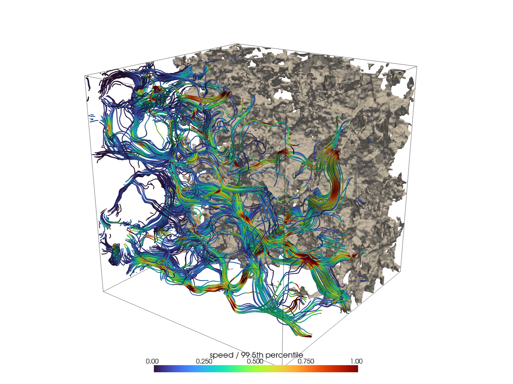

<h1 align="center">PoreWise</h1>

<p align="center">
  <a href="https://github.com/SalehMohammadrezaei/PoreWise/actions/workflows/cpu.yml"></a>
  <a href="LICENSE"></a>
</p>

<p align="center">
  
</p>

## Overview

**PoreWise** computes the absolute permeability of porous materials directly from 2D and 3D
images, such as segmented micro-CT scans of rocks, foams, filters and microfluidic devices.
It solves creeping flow in the pore space with the lattice Boltzmann method and returns the
permeability in each direction or the full permeability tensor.

PoreWise runs on a single GPU or on CPU cores, and is designed so that images of a billion
voxels fit on one workstation.

Formerly LBM-Permeability.

## Capabilities

- **Permeability tensor** of a 3D image (or 2x2 in 2D) from three independent flow directions,
  with principal values, principal directions and a symmetry check
- **Sealed-sample mode** (`mirror=True`): solves on the mirrored image, which removes the
  artificial resistance a periodic wrap adds to a non-periodic sample
- **Two collision models**: BGK, and two-relaxation-time (TRT), which gives a permeability that
  does not depend on the chosen relaxation time
- **Pore-only solvers** for GPU (`cuda-sparse`) and CPU (`numba-sparse`): solid voxels take no
  memory and no computing time
- **Large images**: a 1024-cube sandstone runs on one 48 GB GPU in a few hours
- **Quality control**: each run reports convergence, mass conservation, Mach and Reynolds
  numbers, and returns a permeability only when the checks pass
- **Output**: JSON results with full settings and provenance, velocity and density fields,
  VTI export for ParaView
- **Pore-space tools**: porosity, connectivity report, local-thickness distribution, synthetic
  test geometries
- **Command line and Python interfaces**

## Installation

```bash
git clone https://github.com/SalehMohammadrezaei/PoreWise.git
cd PoreWise
python -m venv .venv && source .venv/bin/activate
pip install .            # core, NumPy reference solvers
pip install '.[gpu]'     # CuPy, for NVIDIA GPUs (CUDA 12)
pip install '.[cpu]'     # Numba, for the multi-core CPU solver
pip install '.[viz]'     # Matplotlib and PyVista, for the examples
```

## Quick start

From the command line, for a labelled image stored as a NumPy array:

```bash
python -m porewise rock.npy --tensor --backend cuda-sparse --collision trt \
    --solid-value 255 --pore-value 0 --dx 5e-6 --output results/rock
```

`--dx` is the voxel size in metres. Use `--backend numba-sparse` on a machine without a GPU.
Results are written to the output folder as JSON, with the permeability in lattice units and
in square metres.

From Python:

```python
import numpy as np
from porewise import compute_permeability_tensor

solid = np.load("rock.npy") == 255          # Boolean array, True = solid, axes (z, y, x)

result = compute_permeability_tensor(
    solid, voxel_size=5e-6, backend="cuda-sparse", collision="trt", tau=0.6
)

print(result["K_m2"])                       # 3x3 tensor in m^2
print(result["principal_values_m2"])
```

A scanned sample is not periodic. Add `mirror=True` (command line: `--mirror`) to get the
directional permeabilities of the sealed sample, as measured in a core-flood; keep the default
for the full tensor and its principal directions. See
[numerical method, conventions and units](docs/numerical_limits.md).

One flow direction only:

```python
from porewise import lbm_stokes_3d, k_from_run, k_lu_to_m2

run = lbm_stokes_3d(solid, F_x=1e-6, backend="cuda-sparse", collision="trt", tau=0.6)
k = k_lu_to_m2(k_from_run(run, "x"), 5e-6)
```

More in [`examples/`](examples): 2D and 3D runs, a permeability-porosity curve, and flow
visualisation.

## Choosing a solver

| Backend | Images | Runs on | Use it for |
|---|---|---|---|
| `cuda-sparse` | 3D | NVIDIA GPU | real samples; fastest and most memory-efficient |
| `numba-sparse` | 3D | CPU cores | the same method without a GPU; set `NUMBA_NUM_THREADS` |
| `cuda` | 2D, 3D | NVIDIA GPU | 2D images; dense 3D reference |
| `numpy`, `cupy-array` | 2D, 3D | CPU, GPU | small cases, teaching, cross-checks |

We recommend `collision="trt"` with `tau=0.6` for rock images.

On a 384-cube sandstone crop (porosity 0.25) `cuda-sparse` processes 4,800 million voxels
per second in 4 GB on an RTX 6000 Ada, and `numba-sparse` reaches 1,000 million on 96 cores.

## Documentation

- [Numerical method, conventions and units](docs/numerical_limits.md)
- [Verification and performance](docs/verification.md): analytical channels and pipes, sphere
  arrays, a published micromodel benchmark and published 1024-cube rock benchmarks
- [Reproducing the benchmarks](docs/benchmark_reproduction.md)

## Citing

If you use PoreWise in your work, please cite it. Citation details are in
[`CITATION.cff`](CITATION.cff); GitHub shows them under "Cite this repository".

## Contributing

Bug reports, questions and pull requests are welcome through the
[issue tracker](https://github.com/SalehMohammadrezaei/PoreWise/issues). Please run
`python -m pytest` before opening a pull request.

## Licence

PoreWise is released under the [MIT licence](LICENSE). Copyright (c) 2026 Saleh Mohammadrezaei.
